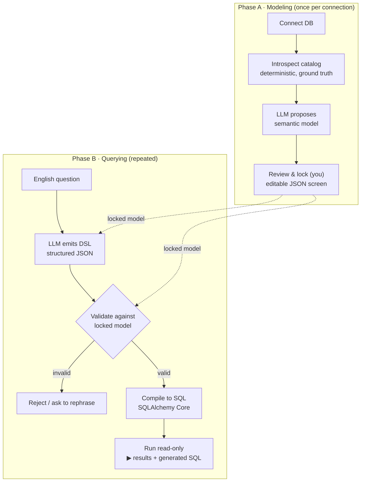

# 🧭 QueryDSL — Reliable Natural-Language Database Querying

[](https://github.com/ashifhusainoo7/QueryDSL/actions/workflows/ci.yml)
[](https://www.python.org/)
[](#testing)
[](https://github.com/astral-sh/ruff)
[](LICENSE)

Ask your SQL database questions in plain English — **without** letting an LLM write raw SQL against your data.

QueryDSL replaces the unreliable *"LLM writes SQL"* pattern with a **constrained, validated Query DSL** that compiles deterministically to safe SQL. The LLM's job shrinks from *"write any SQL against any table"* to *"fill in a small, validated shape."* As a result it **cannot** hallucinate a column, run a `DELETE`, or skip the row limit — those guarantees live in code, not in a prompt.

---

## What this project demonstrates

> A focused look at the engineering, for anyone reviewing this as a work sample.

- **Safety by construction, not by prompting.** The reliability guarantees are enforced by a validation gate and a deterministic compiler — verifiable in code and covered by tests — rather than by asking an LLM nicely.
- **Clean architecture with sharp boundaries.** A deterministic core (introspect → validate → compile) with **zero LLM dependencies**, isolated from the LLM-facing layer. Each module has one responsibility and a well-defined interface.
- **Test-driven development.** 43 tests; the deterministic core is fully unit-tested against an in-memory SQLite fixture (no DB server or API keys needed), while the non-deterministic LLM steps are mocked.
- **Pragmatic use of the right tools.** Pydantic for a self-validating DSL, SQLAlchemy Core for injection-proof SQL generation, LangChain `with_structured_output` for schema-constrained LLM output, multi-provider support (OpenAI / Anthropic / Google / Groq).
- **Engineering process artifacts.** The repo ships its [design spec](docs/superpowers/specs/2026-06-13-querydsl-design.md) and [implementation plan](docs/superpowers/plans/2026-06-13-querydsl.md) — the reasoning behind the architecture, not just the result.
- **CI + linting** on Python 3.11 and 3.12 (ruff + pytest) on every push.

---

## The problem

The common approach — hand an LLM a SQL toolkit and a prompt saying *"please don't run DML, please limit rows, please avoid sensitive columns"* — is unreliable because **a prompt is a suggestion, not a constraint.** It produces:

- **Confidently wrong answers** — valid SQL with the wrong join/filter, undetectable by users.
- **Broken SQL** — hallucinated table/column names.
- **Unsafe operations** — nothing in code actually prevents destructive statements.
- **Inconsistency** — the same question yields different SQL on different runs.

QueryDSL moves the guarantee from the prompt into **code**.

---

## How it works



### The four safety properties — enforced by code, not prompting

| Property | Enforced by |
|---|---|
| No hallucinated tables/columns | `validate._resolve_field` (against the locked model) + `Compiler._reflected_column` (against the real reflected table) |
| No DML / DDL / injection | DSL grammar has only `SELECT`-shaped nodes; SQL is built from bound SQLAlchemy Core objects, never string concatenation |
| Row limit always applied | clamped in `validate`, unconditional `.limit()` in the compiler |
| Sensitive fields excluded by default | default projection drops `sensitive=True` fields |

---

## Architecture

```
querydsl/
  models.py       # Catalog, SemanticModel, DSLQuery (Pydantic — single source of truth for shapes)
  introspect.py   # DB → deterministic catalog (no LLM)
  validate.py     # DSL checked against the locked model — the gate (no LLM)
  compiler.py     # DSL → safe SQL via SQLAlchemy Core — the reliability core (no LLM)
  semantic.py     # catalog + LLM → proposed semantic model
  nl_to_dsl.py    # English + LLM → validated DSL, with one self-correcting retry
  db.py / llm.py  # connection + multi-provider LLM factory
app.py            # Streamlit UI: connect → review/lock model → query
tests/            # 43 tests; deterministic core fully covered, LLM steps mocked
docs/superpowers/ # design spec + implementation plan
```

---

## Quickstart

### 1. Install

```bash
git clone https://github.com/ashifhusainoo7/QueryDSL.git
cd QueryDSL
uv venv
uv pip install -e ".[dev]"          # core + dev tools
# uv pip install -e ".[dev,mssql]"  # add this if connecting to SQL Server (installs pyodbc)
```

(Or `python -m venv .venv && pip install -e ".[dev]"` if you don't use [uv](https://github.com/astral-sh/uv).)

### 2. Run the tests

```bash
python -m pytest -v
```

### 3. Launch the app

```bash
streamlit run app.py
```

Then in the browser:

1. **Database** — for a quick try, check *"Use SQLite file"* and point it at a local SQLite file; or enter your SQL Server details. Click **Connect database**.
2. **LLM** — pick a provider (OpenAI / Anthropic / Google / Groq), enter the model name and API key, click **Initialize LLM**.
3. **Review the model** — click **Propose model from schema**, check/edit the proposed entities, relationships, and `sensitive` flags, then **✅ Lock model**.
4. **Ask** — type a question like *"how many users per company?"* and click **Run**. You get the results table plus the generated DSL and SQL.

---

## Testing

```bash
python -m pytest -v      # 43 tests
ruff check .             # lint
```

- **Compiler tests** (the core): `DSLQuery → SQL`, executed against an in-memory SQLite fixture, asserting on real returned rows.
- **Validation tests**: malformed DSL (unknown field, attempted aggregation misuse, out-of-range limit) must be rejected.
- **Introspection tests**: catalog built from a fixture DB is correct, including foreign keys.
- **LLM steps**: tested with mocked models — assert the call contract and the validation-retry behaviour, not exact (non-deterministic) output.

No database server or API keys are required to run the suite.

---

## Supported today (Level 2)

- Lookups and filters (`eq`, `ne`, `lt`, `lte`, `gt`, `gte`, `in`, `like`, `is_null`)
- Single-hop joins across declared relationships
- Aggregations (`COUNT` / `SUM` / `AVG` / `MIN` / `MAX`), `GROUP BY`, `HAVING`
- Sorting and an always-applied row limit

### Future work

- Time-series bucketing / trend analysis
- Subqueries, window functions, ranking ("top N per group")
- Multi-hop / chained joins

---

## Production note

The DSL structurally cannot emit writes, but when pointing at a real database, connect with a **read-only database login** as a defense-in-depth second layer.

---

## Author

**Ashif Husain**

- GitHub: [@ashifhusainoo7](https://github.com/ashifhusainoo7)

---

## License

[MIT](LICENSE)
